# 🚀 Crypto Insights Dashboard

<div align="center">
  

  <!-- Badges -->
  
  
  
  
  
</div>

## 📌 Overview

A sophisticated cryptocurrency analysis platform combining real-time data, AI insights, and sentiment analysis to empower informed investment decisions.

### Core Features
- Real-time cryptocurrency price tracking & visualization
- AI-powered market analysis using Google's Gemini Pro
- Sentiment-analyzed news aggregation & categorization
- Technical indicators with support/resistance levels
- Interactive charting with volume analysis

<div align="center">
  
  <p><em>AI-Powered Market Analysis with Technical Indicators</em></p>
</div>

## 🏗️ System Architecture

```mermaid
graph TB
    A[Client Browser] --> B[Flask Server]
    B --> C[CryptoCompare API]
    B --> D[Google Gemini API]
    B --> E[Serper API]
    
    subgraph "External Services"
        C["💱 CryptoCompare
        - Real-time prices
        - Historical data
        - Market metrics"]
        D["🧠 Gemini Pro
        - Market analysis
        - Trend prediction
        - Technical analysis"]
        E["📰 Serper
        - News aggregation
        - Content analysis
        - Sentiment scoring"]
    end
    
    subgraph "Core Features"
        F["📊 Price Analytics
        - Real-time updates
        - Volume analysis
        - Technical indicators"]
        G["🎯 Market Insights
        - Support/Resistance
        - Trend analysis
        - Trading signals"]
        H["💭 News Analysis
        - Sentiment categorization
        - Impact assessment
        - Source verification"]
    end

    B --> F
    B --> G
    B --> H

    style A fill:#f9f,stroke:#333,stroke-width:2px
    style B fill:#ccf,stroke:#333,stroke-width:2px
    style C fill:#9cf,stroke:#333,stroke-width:2px
```



## 💻 Technical Implementation

### Backend Architecture


### Data Flow


## 📊 Feature Showcase

### Real-Time Price Tracking
<div align="center">
  
  <p><em>Interactive Price Charts with Volume Analysis</em></p>
</div>

**Key Components:**
- Interactive Chart.js visualization
- Volume data overlay
- Support/resistance indicators
- Price metrics dashboard
- 24h high/low tracking

### News Sentiment Analysis
<div align="center">
  
  <p><em>Category-based News Feed with Sentiment Indicators</em></p>
</div>

**Features:**
- Categorized news sections
  - Market Updates
  - Development News
  - Regulatory News
- Sentiment indicators (🟢 Positive, 🔴 Negative, ⚪ Neutral)
- Source credibility tracking
- Real-time updates

## 🛠️ Technology Stack

| Category | Technology | Purpose | Implementation Details |
|----------|------------|---------|----------------------|
| Backend | Flask | Web Framework | - Route handling<br>- API integration<br>- Data processing |
| AI/ML | Gemini Pro | Market Analysis | - Price trend analysis<br>- Support/resistance detection<br>- Market sentiment |
| Data | CryptoCompare | Price Data | - Real-time prices<br>- Historical data<br>- Market metrics |
| Frontend | Chart.js | Visualization | - Interactive charts<br>- Technical indicators<br>- Volume analysis |
| Cache | Flask-Caching | Performance | - 5-minute cache<br>- API rate limiting<br>- Data optimization |
| UI | CSS3 | Styling | - Glassmorphism design<br>- Responsive layout<br>- Dark theme |

## 🚀 Installation & Setup

### Prerequisites
```bash
# Required versions
Python >= 3.9
Node.js >= 14.0 (for Chart.js)
```

### Environment Setup
```bash
# Clone repository
git clone https://github.com/yourusername/crypto-insights.git
cd crypto-insights

# Create virtual environment
python -m venv venv
source venv/bin/activate  # Windows: venv\Scripts\activate

# Install dependencies
pip install -r requirements.txt
```

### Configuration
Create a `.env` file:
```bash
CRYPTOCARE_API_KEY=your_cryptocompare_key
GEMINI_API_KEY=your_gemini_key
SERPER_API_KEY=your_serper_key
```

### Running the Application
```bash
python app.py
# Visit http://localhost:5000
```

## 📈 Features in Detail

### Price Analysis
- Real-time price updates
- Volume analysis
- Technical indicators
- Support/resistance levels
- Price change percentage
- Market cap tracking

### AI Analysis
- Trend prediction
- Market sentiment analysis
- Technical analysis
- Trading signals
- Risk assessment

### News Integration
- Real-time news aggregation
- Sentiment analysis
- Category classification
- Source credibility scoring
- Impact assessment

## 🔄 Data Flow Process

1. **Data Collection**
   - Real-time price fetching
   - News aggregation
   - Market metrics compilation

2. **Processing**
   - AI analysis
   - Sentiment scoring
   - Technical indicator calculation

3. **Presentation**
   - Interactive visualization
   - Categorized display
   - Real-time updates

## 🛣️ Roadmap

### Phase 1: Enhancement
- [ ] WebSocket implementation
- [ ] Additional cryptocurrencies
- [ ] Enhanced technical indicators

### Phase 2: Features
- [ ] User authentication
- [ ] Portfolio tracking
- [ ] Price alerts

### Phase 3: Advanced
- [ ] Machine learning predictions
- [ ] Advanced charting options
- [ ] API access

## 🤝 Contributing

1. Fork the repository
2. Create your feature branch
3. Commit changes
4. Push to branch
5. Create Pull Request

## 📄 License

This project is licensed under the MIT License. See [LICENSE](LICENSE) for details.

## 🙏 Acknowledgments

- CryptoCompare API
- Google Gemini Pro
- Serper API
- Chart.js
- Flask Community
